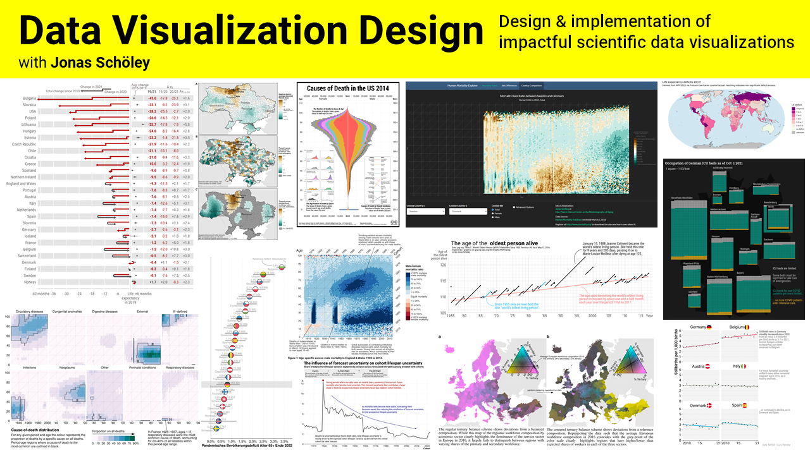

# Data Visualization Design

June 23-27, 2025 · Jonas Schöley  · [jschoeley.com](https://www.jschoeley.com/)

Course description
------------------

"Visualizing Data" is an intensive five day workshop where participants practice the trade of data visualization. Visualization will be taught as a *design process*: In order to design effective visualization one needs to have a clear communication purpose in mind, know the audience, know a wide range of visualization idioms, be fluent in the tools required to transform imagination into a finished product, and be able to evaluate the effectiveness of the visualization. This broad range of skills requires the integration of theory and practice. Participants will learn about visualization theory, including human perception, marks and channels, the visualization design process, and best practices. They will create their own visualizations given a question and a dataset, recreate, criticize and improve upon existing visualizations, and -- supported by the group and the lecturer -- work on their own visualization project.

Upon completion of the course the participants will:

  - understand visualization as a design process (as opposed to a set of techniques)
  - formulate a question and design an effective visualization to answer it

Participants learn the technical skills to:

  - use `R` in conjunction with `ggplot2`, `dplyr` and `tidyr` to create a wide range of static visualizations
  - produce multi-layered maps and perform basic geocomputation using the `sf` package
  - be able to produce interactive visualizations with `R` and [`shiny`](https://www.shinyapps.io/)

Course Outline
--------------

- 5 day workshop combining lectures and practicals
- 3.5 hours per day
- June 23-27, 2025 @ [MPIDR](https://www.demogr.mpg.de/en/)

Time          | Activity
------------- | ---------------------------------
09:30--09:45  | (Monday only) Orientation meeting
10:00--12:00  | lecture
12:00--13:00  | lunch break
13:00--14:30  | lecture + practical
Afternoon     | work on project proposal

- Day 1: Visualization design
- Day 2: Visual perception
- Day 3: Visualizing spatial data
- Day 4: Visualizing spatial data, ctnd.
- Day 5: Interaction and animation & Project presentation

Course prerequisites
--------------------

In their application for the course participants *need to propose a visualization project* which can be finished over the course of the week. I suggest to produce an explanatory graphic for a particular data set and topic.

Participants need to bring a laptop with the latest available versions of [R](https://cran.r-project.org/), and [Inkscape](https://inkscape.org/) installed on it.

Participants will profit from basic experience in using R (loading data, installing and loading packages, indexing vectors, data.frames and matrices).

Examination
-----------

Participants pass the course if they finish the visualization project outlined in their proposal.

Course ressources
-----------------

- **Day 1: Visualization design**
  - [**Slides** Visualization design](https://github.com/jschoeley/phds25-datavizdesign/tree/main/01-design)
  - [**Excercise** Direct annotation](https://github.com/jschoeley/phds25-datavizdesign/tree/main/excersises/direct_annotation)
  - [**Excercise** Cumulative plot reveal](https://github.com/jschoeley/phds25-datavizdesign/tree/main/excersises/cumulative_reveal)
  - [**Example** England & Wales mortality sex ratios](https://github.com/jschoeley/phds25-datavizdesign/tree/main/examples/ewsexratio)
  - [**Further reading** Munzner (2024). Visualization Analysis & Design](https://www.taylorfrancis.com/books/mono/10.1201/b17511/visualization-analysis-design-tamara-munzner)
- **Day 2: Visual perception**
  - [**Slides** Visual perception](https://github.com/jschoeley/phds25-datavizdesign/tree/main/02-perception)
  - [**Example** Lexis surface plots and the effective use of color](https://github.com/jschoeley/phds25-datavizdesign/tree/main/examples/lexiscolors)
  - [**Further reading** Ware (2023). Information Visualization. Perception for Design](https://shop.elsevier.com/books/information-visualization/ware/978-0-12-812875-6)
- **Day 3: Visualizing spatial data**
  - [**Slides** Visualizing spatial data](https://github.com/jschoeley/phds25-datavizdesign/tree/main/03-maps)
  - [**Excercise** Basemap](https://github.com/jschoeley/phds25-datavizdesign/tree/main/excersises/basemap)
  - [**Example** DHS borders](https://github.com/jschoeley/phds25-datavizdesign/tree/main/examples/dhsborders)
  - [**Example** Raster data](https://github.com/jschoeley/phds25-datavizdesign/tree/main/examples/raster)
  - [**Example** Nonspatial raster data](https://github.com/jschoeley/phds25-datavizdesign/tree/main/examples/viscomplexis-smallmultiples)
  - [**Example** Background map](https://github.com/jschoeley/phds25-datavizdesign/tree/main/examples/backgroundmap)
  - [**Further reading** Introduction to the `terra` package](https://rspatial.org/pkg/1-introduction.html)
- **Day 4: Visualizing spatial data, ctnd.**
  - [**Example** French TFR](https://github.com/jschoeley/phds25-datavizdesign/tree/main/examples/frenchtfr)
  - [**Example** Bivariate Fertility](https://github.com/jschoeley/phds25-datavizdesign/tree/main/examples/bivarfertility)
  - [**Example** Tricolore](https://cran.r-project.org/web/packages/tricolore/vignettes/choropleth_maps_with_tricolore.html)
  - [**Example** Global lifetables](https://github.com/jschoeley/phds25-datavizdesign/tree/main/examples/lifetablesglobal)
  - [**Example** Mapping uncertainty](https://github.com/jschoeley/phds25-datavizdesign/tree/main/examples/mappinguncertainty)
  - [**Example** Bubble grid](https://github.com/jschoeley/phds25-datavizdesign/tree/main/examples/bubblegrid)
  - [**Further reading** Simple Features for R](https://r-spatial.github.io/sf/index.html)
- **Day 5: Dynamic vizualizations**
  - Animation
      - [**Example** German ICU occupation](https://github.com/jschoeley/phds25-datavizdesign/tree/main/examples/germanicus)
      - [**Example** e0 animation](https://github.com/jschoeley/phds25-datavizdesign/tree/main/examples/e0animate)
  - Interactivity
      - [**Example** Likelihood guessr](https://github.com/jschoeley/phds25-datavizdesign/tree/main/examples/likelihoodguessr)
      - [**Example** HMD explorer](https://github.com/jschoeley/phds25-datavizdesign/tree/main/examples/hmdexplorer)
      - [**Example** Interactive TFR](https://github.com/jschoeley/phds25-datavizdesign/tree/main/examples/interactivetfr)