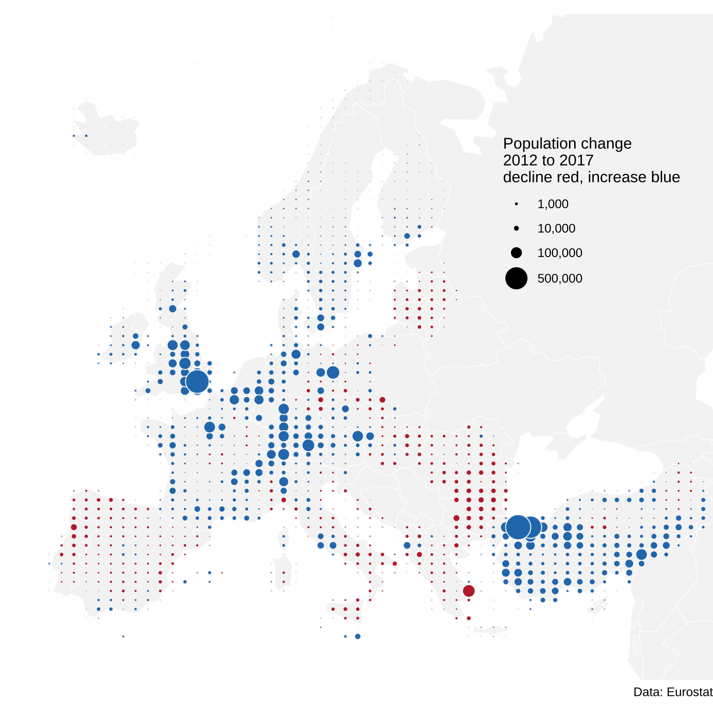

# Bubble grid

Jonas Schöley  · [jschoeley.com](https://www.jschoeley.com/)

Demonstration on how use the [`sf`](https://r-spatial.github.io/sf/index.html) package to aggregate spatial count data over a regular grid and to plot the result using point symbols, a.k.a. a bubble grid map.

