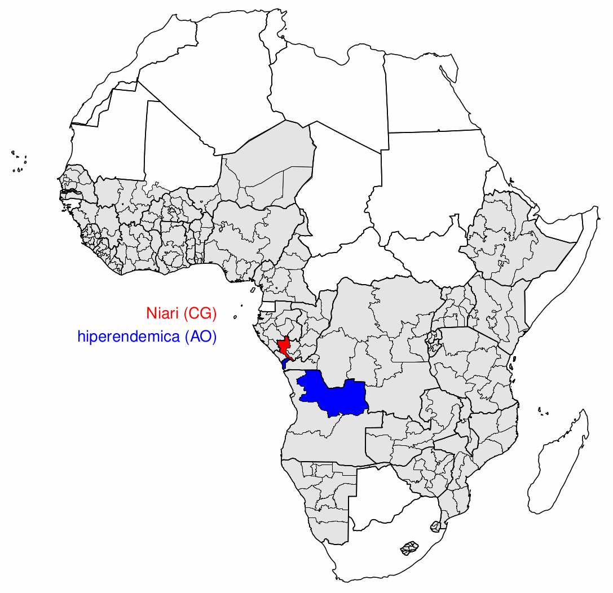

# DHS borders

Using [`sf`]() we identify and plot pairs of DHS regions which share an international border. This example demonstrates how to import shapefiles into R and how to perform spatial computations on vector data.

