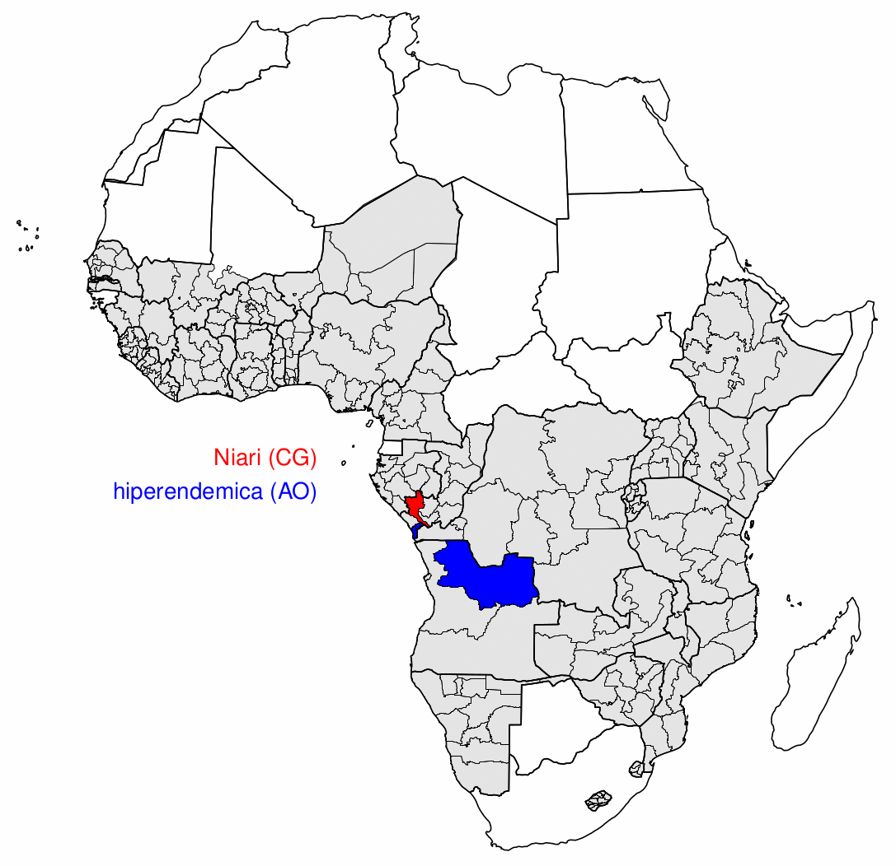

# DHS borders

Jonas Schöley  · [jschoeley.com](https://www.jschoeley.com/)

Using [`sf`](https://r-spatial.github.io/sf/index.html) we identify and plot pairs of DHS regions which share an international border. This example demonstrates how to import shapefiles into R and how to perform spatial computations on vector data.

