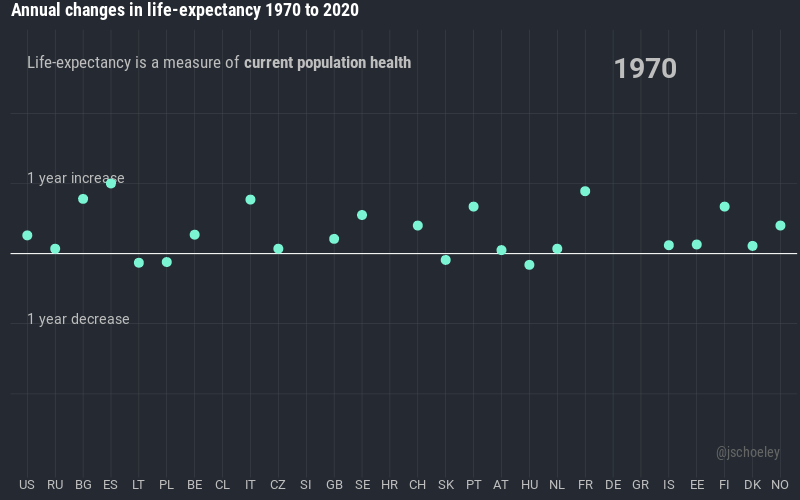

# Animated annual changes in life-expectancy

Jonas Schöley  · [jschoeley.com](https://www.jschoeley.com/)

Animation of annual life expectancy changes across a range of countries since 1970. Created using the [`gganimate`](https://gganimate.com/) library. The data comes from [Aburto, Schöley et al. 2021. Quantifying impacts of the COVID-19 pandemic through life-expectancy losses](https://doi.org/10.1093/ije/dyab207).

