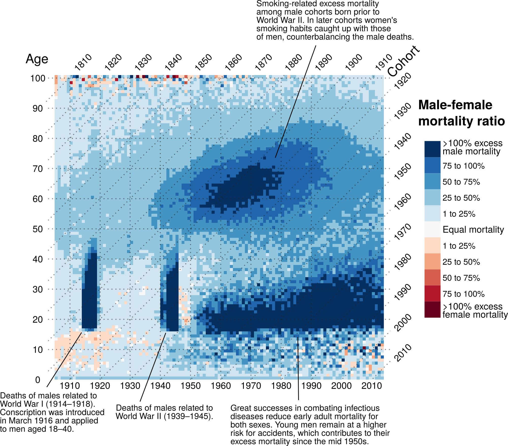

# England & Wales mortality sex ratios

Jonas Schöley  · [jschoeley.com](https://www.jschoeley.com/)

Using mortality rates for England and Wales across period, age, and sex provided by HMD (mortality.org), we calculate the male-female-mortality-ratios and plot it as a Lexis surface, a heat-map over time and age.

A plot like this has been published in [Schöley & Willekens (2017). Visualizing compositional data on the Lexis surface](https://www.demographic-research.org/articles/volume/36/21).

