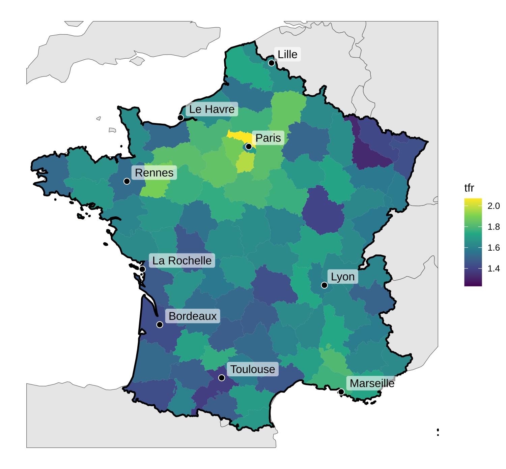

# French TFR

Jonas Schöley  · [jschoeley.com](https://www.jschoeley.com/)

An example demonstrating the combination of basemaps and choropleth layers using the [`sf`](https://r-spatial.github.io/sf/) package. We plot the French TFR by region in the year 2023.

