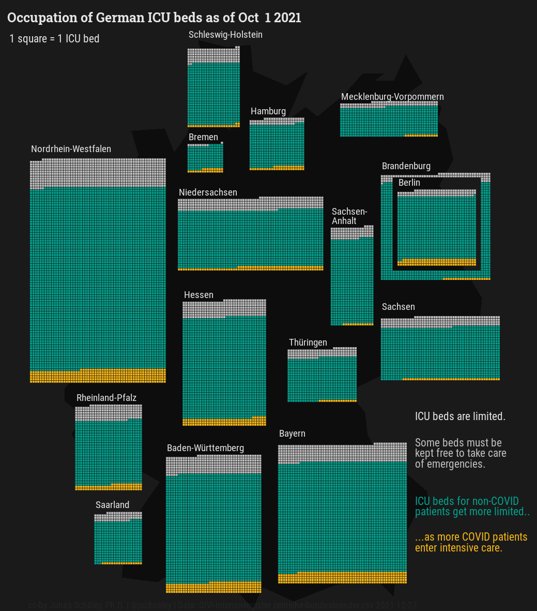

# Animated Geo-Waffleplots of German intensive care utilization during COVID-19

Jonas Schöley  · [jschoeley.com](https://www.jschoeley.com/)

This animation features a custom layout for the waffleplots which I've defined by manually editing a bitmap file. The state grid layout is encoded in a 24-bit bitmap with state codes encoded in red channel values 1 to 16 in alphabetic order. Each state has as many pixels as it's maximum reported number of ICU beds between 2021-07-01 and 2021-12-04.

