ggplot: Lexis surface plots and the effective use of color
================
Jonas Schöley
June 24, 2025

- [Lexis Surfaces in GGplot](#lexis-surfaces-in-ggplot)
  - [1x1 year data](#1x1-year-data)
  - [nxm year data](#nxm-year-data)
  - [Discrete Period and Age Scales](#discrete-period-and-age-scales)
- [Sequential Colour Scales: Plotting
  Magnitudes](#sequential-colour-scales-plotting-magnitudes)
- [Divergent Colour Scales: Plotting Differences &
  Proportions](#divergent-colour-scales-plotting-differences--proportions)
- [Qualitative Colour Scales: Plotting Group
  Membership](#qualitative-colour-scales-plotting-group-membership)
- [Experiment in perception: using area instead of
  colour](#experiment-in-perception-using-area-instead-of-colour)
- [Further Reading](#further-reading)

``` r
library(tidyverse)
```

    ## ── Attaching core tidyverse packages ──────────────────────── tidyverse 2.0.0 ──
    ## ✔ dplyr     1.1.4     ✔ readr     2.1.5
    ## ✔ forcats   1.0.0     ✔ stringr   1.5.1
    ## ✔ ggplot2   3.5.1     ✔ tibble    3.2.1
    ## ✔ lubridate 1.9.4     ✔ tidyr     1.3.1
    ## ✔ purrr     1.0.4     
    ## ── Conflicts ────────────────────────────────────────── tidyverse_conflicts() ──
    ## ✖ dplyr::filter() masks stats::filter()
    ## ✖ dplyr::lag()    masks stats::lag()
    ## ℹ Use the conflicted package (<http://conflicted.r-lib.org/>) to force all conflicts to become errors

## Lexis Surfaces in GGplot

Lexis surfaces show the value of a third variable on a period-age-grid.
If the value of the third variable is given via colour the resulting
plot is known as “Heatmap” and used in many disciplines. In ggplot we
produce heatmaps using `geom_tile()` or `geom_rect()`. These geometries
draw rectangles at specified xy-positions. By default all rectangles are
equal in size. They can be coloured according to some variable in the
data.

`geom_rect()` is faster and produces smaller pdf’s, while `geom_tile()`
allows to specify the dimensions of the rectangles making it useful for
data that does not come in single year period and age intervals.

For now we will ignore the colouring aspect and just look at how ggplot
draws rectangles.

### 1x1 year data

We work with data from the [Human Mortality
Database](http://www.mortality.org) – Swedish period mortality rates by
sex.

``` r
swe <- read_csv("https://raw.githubusercontent.com/jschoeley/idem_viz/master/ggplot_practical/02-color_and_lexis_surfaces/mortality_surface_sweden.csv")
```

    ## Rows: 53918 Columns: 8
    ## ── Column specification ────────────────────────────────────────────────────────
    ## Delimiter: ","
    ## chr (3): Country, Timeframe, Sex
    ## dbl (5): Year, Age, Dx, Nx, mx
    ## 
    ## ℹ Use `spec()` to retrieve the full column specification for this data.
    ## ℹ Specify the column types or set `show_col_types = FALSE` to quiet this message.

``` r
head(swe)
```

    ## # A tibble: 6 × 8
    ##   Country Timeframe Sex     Year   Age    Dx     Nx     mx
    ##   <chr>   <chr>     <chr>  <dbl> <dbl> <dbl>  <dbl>  <dbl>
    ## 1 SWE     Period    Female  1751     0 5988  28214. 0.212 
    ## 2 SWE     Period    Male    1751     0 6902  28627. 0.241 
    ## 3 SWE     Period    Female  1751     1 1286. 26035. 0.0494
    ## 4 SWE     Period    Male    1751     1 1360. 25683. 0.0530
    ## 5 SWE     Period    Female  1751     2  835. 25880. 0.0322
    ## 6 SWE     Period    Male    1751     2  882. 25504. 0.0346

Only specifying x and y position and omitting colour puts a grey
rectangle at every xy position that appears in the data. The resulting
plot gives us information about the period-ages where we have mortality
data on Swedish females.

``` r
swe %>% filter(Sex == "Female") %>%
  ggplot() +
  geom_tile(aes(x = Year, y = Age))
```

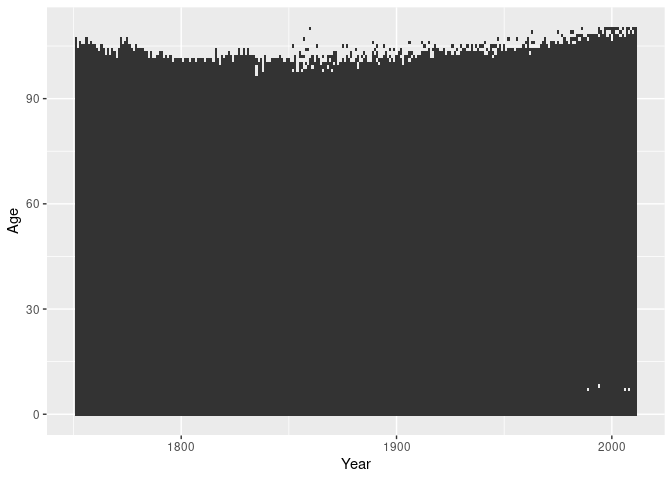<!-- -->

When constructing Lexis surfaces it is a good idea to use isometric
scales. The distance corresponding to a single year should be the same
on the x and the y scales (a 1x1 rectangle should actually be a square).
We can force such an equality by adding a suitable coordinate layer.

``` r
swe %>% filter(Sex == "Female") %>%
  ggplot() +
  geom_tile(aes(x = Year, y = Age)) +
  coord_equal()
```

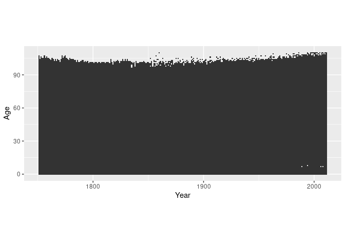<!-- -->

By default the small rectangles have a width and height of 1 scale unit
and are drawn over the mid-points of the corresponding x and y values.

``` r
swe %>% filter(Sex == "Female") %>%
  ggplot() +
  geom_tile(aes(x = Year, y = Age), colour = "white") +
  scale_x_continuous(breaks = 1800:1810) +
  scale_y_continuous(breaks = 100:110) +
  coord_equal(xlim = c(1800, 1810), ylim = c(100, 110))
```

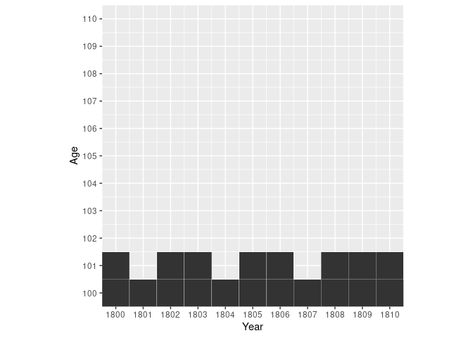<!-- -->

Shifting the data by 0.5 in x and y aligns things neatly.

``` r
swe %>% filter(Sex == "Female") %>%
  mutate(Year = Year + 0.5, Age = Age + 0.5) %>%
  ggplot() +
  geom_tile(aes(x = Year, y = Age), colour = "white") +
  scale_x_continuous(breaks = 1800:1810) +
  scale_y_continuous(breaks = 100:110) +
  coord_equal(xlim = c(1800, 1810), ylim = c(100, 110))
```

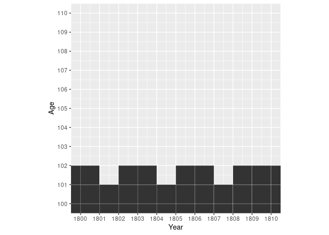<!-- -->

### nxm year data

If our data does not come in single year and age groups we have to
adjust the `width` and/or `height` of the rectangles. `width` and
`height` are regular aesthetics and can be mapped to variables in the
data.

``` r
cod <- read_csv("https://raw.githubusercontent.com/jschoeley/idem_viz/master/ggplot_practical/02-color_and_lexis_surfaces/cod.csv")
```

    ## Rows: 3300 Columns: 6
    ## ── Column specification ────────────────────────────────────────────────────────
    ## Delimiter: ","
    ## chr (3): AgeGr, Sex, COD
    ## dbl (3): Year, Age, w
    ## 
    ## ℹ Use `spec()` to retrieve the full column specification for this data.
    ## ℹ Specify the column types or set `show_col_types = FALSE` to quiet this message.

``` r
head(cod)
```

    ## # A tibble: 6 × 6
    ##    Year   Age AgeGr     w Sex    COD  
    ##   <dbl> <dbl> <chr> <dbl> <chr>  <chr>
    ## 1  1925     0 <1        1 Female Other
    ## 2  1925     0 <1        1 Male   Other
    ## 3  1925     1 1-4       4 Female Other
    ## 4  1925     1 1-4       4 Male   Other
    ## 5  1925     5 5-9       5 Female Other
    ## 6  1925     5 5-9       5 Male   Other

The Cause of Death data features age groups of different sizes (1, 4, or
5 years). This is how it looks like if we plot it without any regard to
the size of the age groups.

``` r
cod %>% filter(Sex == "Female") %>%
  mutate(Year = Year + 0.5) %>%
  ggplot() +
  geom_tile(aes(x = Year, y = Age),
            colour = "white") +
  coord_equal()
```

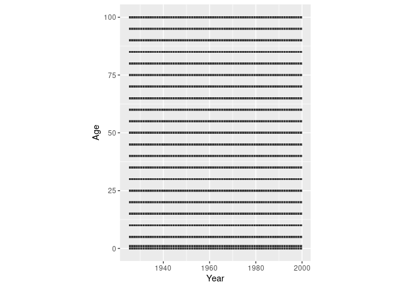<!-- -->

Now we shift the rectangles away from the age midpoint and scale them in
height according to the width of the age group.

``` r
cod %>% filter(Sex == "Female") %>%
  mutate(Year = Year + 0.5, Age = Age + w/2) %>%
  ggplot() +
  geom_tile(aes(x = Year, y = Age, height = w),
            colour = "white") +
  coord_equal()
```

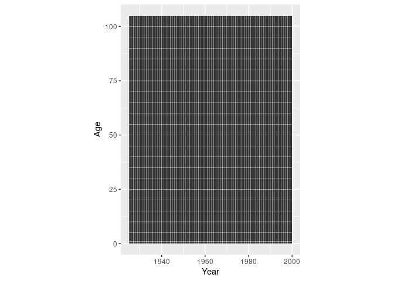<!-- -->

### Discrete Period and Age Scales

If we use discrete axis (happens automatically if we supply a
non-numeric variable to the x or y aesthetic) we loose any control over
the placement of the age or period groups. They will be equally spaced
along the axis.

``` r
cod %>% filter(Sex == "Female") %>%
  mutate(Year = Year + 0.5, Age = AgeGr) %>%
  ggplot() +
  geom_tile(aes(x = Year, y = Age), colour = "white") +
  coord_equal()
```

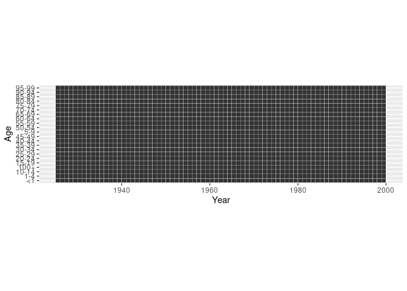<!-- -->

**Avoid character or factor variables as your period or age groups.**
Whenever possible go with numeric “Start of Interval” and “Interval
Width” variables.

## Sequential Colour Scales: Plotting Magnitudes

If we plot magnitudes we would like to use a colour scale which has an
intrinsic ordering to it. Scales that vary from dark to light are
suitable and we call them “sequential”.
`scale_fill_brewer(type = "seq")` provides you with such a scale.

``` r
breaks_mx <- c(0, 0.0001, 0.001, 0.01, 0.1, Inf)
swe %>%
  mutate(Year = Year + 0.5, Age = Age + 0.5,
         mx_cut = cut(mx, breaks = breaks_mx)) %>%
  ggplot() +
  geom_tile(aes(x = Year, y = Age, fill = mx_cut)) +
  scale_fill_brewer(type = "seq") +
  facet_wrap(~Sex, ncol = 1) +
  guides(fill = guide_legend(reverse = TRUE)) +
  coord_equal()
```

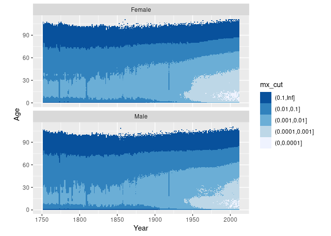<!-- -->

Continuous colour scales take the form of a smooth colour gradient.
Getting the gradient to look like you want can be tricky.

``` r
swe %>%
  mutate(Year = Year + 0.5, Age = Age + 0.5) %>%
  ggplot() +
  geom_tile(aes(x = Year, y = Age, fill = mx)) +
  scale_fill_distiller(type = "seq", palette = "PuBuGn") +
  facet_wrap(~Sex, ncol = 1) +
  coord_equal()
```

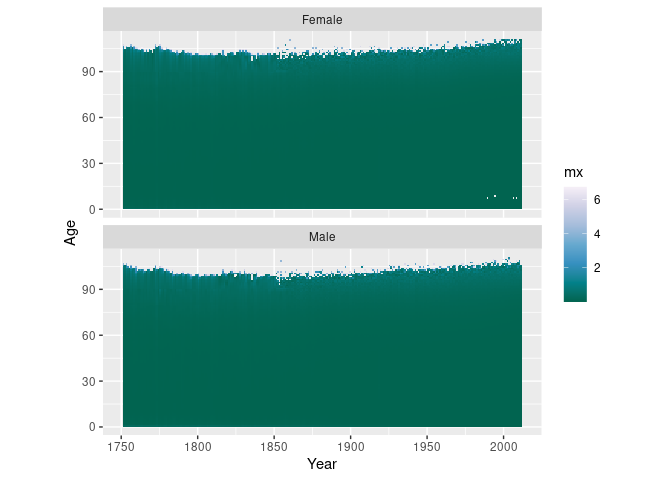<!-- -->

Log transform the colour scale.

``` r
swe %>%
  mutate(Year = Year + 0.5, Age = Age + 0.5) %>%
  ggplot() +
  geom_tile(aes(x = Year, y = Age, fill = mx)) +
  scale_fill_distiller(type = "seq", palette = "PuBuGn", trans = "log10") +
  facet_wrap(~Sex, ncol = 1) +
  coord_equal()
```

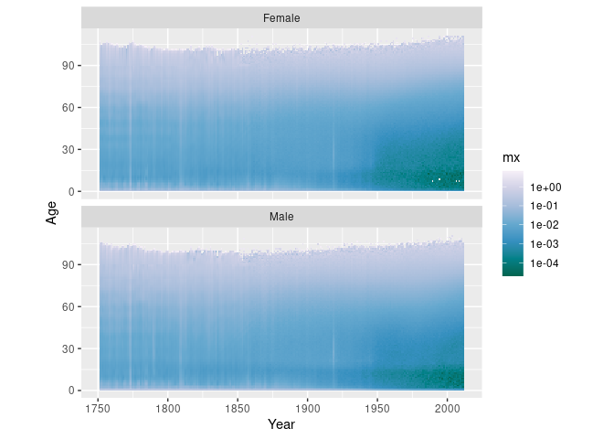<!-- -->

Make high values dark and low values light.

``` r
swe %>%
  mutate(Year = Year + 0.5, Age = Age + 0.5) %>%
  ggplot() +
  geom_tile(aes(x = Year, y = Age, fill = mx)) +
  scale_fill_distiller(type = "seq", palette = "PuBuGn", trans = "log10",
                       direction = 1) +
  facet_wrap(~Sex, ncol = 1) +
  coord_equal()
```

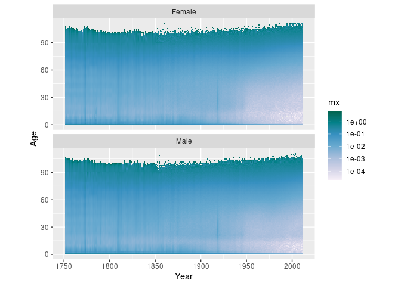<!-- -->

Rescale the colour gradient to increase contrast.

``` r
swe %>%
  mutate(Year = Year + 0.5, Age = Age + 0.5) %>%
  ggplot() +
  geom_tile(aes(x = Year, y = Age, fill = mx)) +
  scale_fill_distiller(type = "seq", palette = "PuBuGn", trans = "log10",
                       direction = 1,
                       values = c(0, 0.3, 0.4, 0.5, 0.6, 1)) +
  facet_wrap(~Sex, ncol = 1) +
  coord_equal()
```

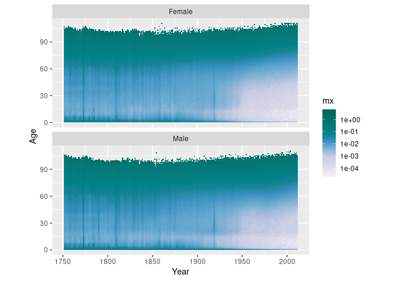<!-- -->

Throw away data outside of the limits.

``` r
swe %>%
  mutate(Year = Year + 0.5, Age = Age + 0.5) %>%
  ggplot() +
  geom_tile(aes(x = Year, y = Age, fill = mx)) +
  scale_fill_distiller(type = "seq", palette = "PuBuGn", trans = "log10",
                       direction = 1,
                       values = c(0, 0.3, 0.4, 0.5, 0.6, 1),
                       limits = c(0.001, 0.5)) +
  facet_wrap(~Sex, ncol = 1) +
  coord_equal()
```

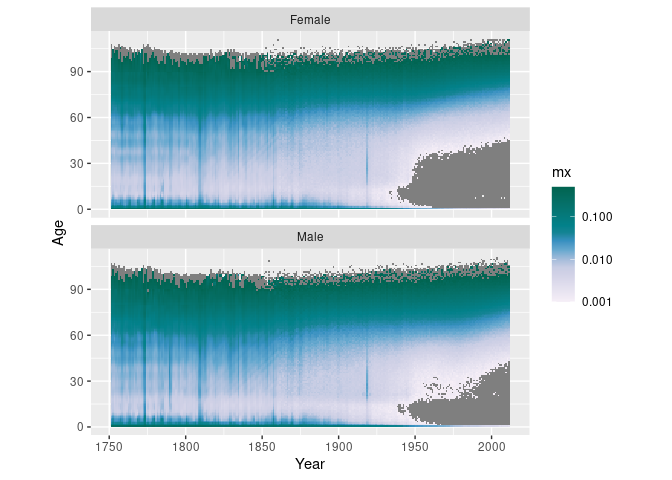<!-- -->

Or instead *squish* the out-of-bounds data into the limits.

``` r
swe %>%
  mutate(Year = Year + 0.5, Age = Age + 0.5) %>%
  ggplot() +
  geom_tile(aes(x = Year, y = Age, fill = mx)) +
  scale_fill_distiller(type = "seq", palette = "PuBuGn", trans = "log10",
                       direction = 1,
                       values = c(0, 0.3, 0.4, 0.5, 0.6, 1),
                       limits = c(0.001, 0.5),
                       oob = scales::squish) +
  facet_wrap(~Sex, ncol = 1) +
  coord_equal()
```

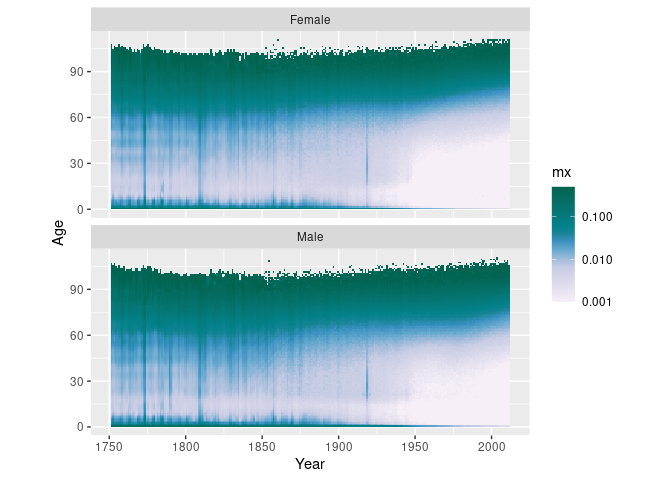<!-- -->

The viridis scales pair perceptual uniformity with strong shifts in hue,
thereby increasing discriminability between different magnitude regions.

``` r
swe %>%
  mutate(Year = Year + 0.5, Age = Age + 0.5) %>%
  ggplot() +
  geom_tile(aes(x = Year, y = Age, fill = mx)) +
  scale_fill_viridis_c(direction = -1,
                       trans = "log10",
                       option = "magma",
                       limits = c(0.001, 0.5),
                       oob = scales::squish) +
  facet_wrap(~Sex, ncol = 1) +
  coord_equal()
```

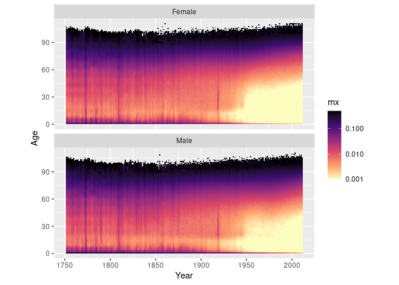<!-- -->

## Divergent Colour Scales: Plotting Differences & Proportions

``` r
breaks_prop_mx <- c(0, 0.5, 0.7, 0.9, 1.1, 1.3, 1.5, Inf)
swe %>%
  mutate(Year = Year + 0.5, Age = Age + 0.5) %>%
  select(-Dx, -Nx) %>%
  tidyr::spread(key = Sex, value = mx) %>%
  mutate(fm_prop_mx = Female / Male,
         fm_prop_mx_disc = cut(fm_prop_mx, breaks_prop_mx)) %>%
  ggplot() +
  geom_tile(aes(x = Year, y = Age, fill = fm_prop_mx_disc)) +
  scale_fill_brewer(type = "div", palette = 5, direction = -1) +
  guides(fill = guide_legend(reverse = TRUE)) +
  coord_equal() +
  theme_dark()
```

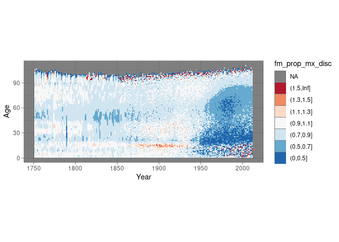<!-- -->

Continuous variant.

``` r
swe %>%
  mutate(Year = Year + 0.5, Age = Age + 0.5) %>%
  select(-Dx, -Nx) %>%
  tidyr::spread(key = Sex, value = mx) %>%
  mutate(fm_diff_mx = Female / Male) %>%
  ggplot() +
  geom_tile(aes(x = Year, y = Age, fill = fm_diff_mx)) +
  # takes 6 colours from a brewer palette and interpolates
  scale_fill_distiller(type = "div",
                       palette = "RdBu",
                       trans = "log10",
                       limits = c(0.5, 2),
                       oob = scales::squish) +
  coord_equal()
```

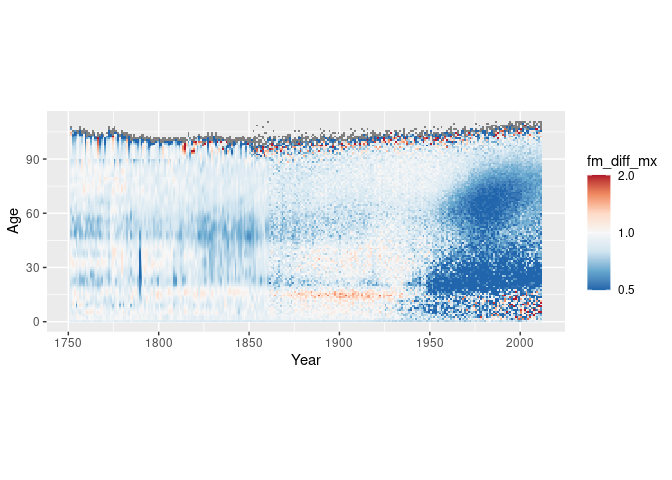<!-- -->

## Qualitative Colour Scales: Plotting Group Membership

``` r
cod %>%
  mutate(Year = Year + 0.5, Age = Age + w/2) %>%
  ggplot() +
  geom_tile(aes(x = Year, y = Age, height = w, fill = COD)) +
  coord_equal() +
  facet_wrap(~Sex, ncol = 2)
```

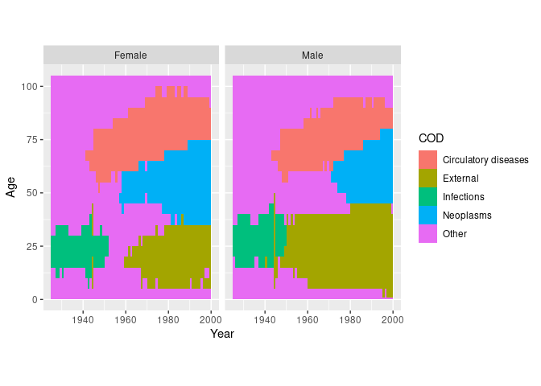<!-- -->

## Experiment in perception: using area instead of colour

Let’s plot a surface of the number of deaths by age. Instead of color as
primary visual encoding we draw points of varying size.

``` r
swe %>%
  filter(Sex == "Female") %>%
  mutate(Year = Year + 0.5, Age = Age + 0.5) %>%
  ggplot(aes(x = Year, y = Age)) +
  geom_point(aes(size = Dx))
```

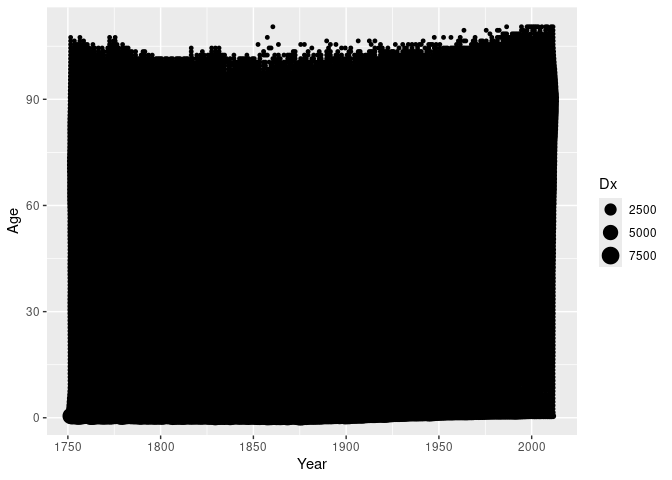<!-- -->

Not helpful. We can set the shape of the points to an open circle to
clean up a bit.

``` r
swe %>%
  filter(Sex == "Female") %>%
  mutate(Year = Year + 0.5, Age = Age + 0.5) %>%
  ggplot(aes(x = Year, y = Age)) +
  geom_point(aes(size = Dx), shape = 1)
```

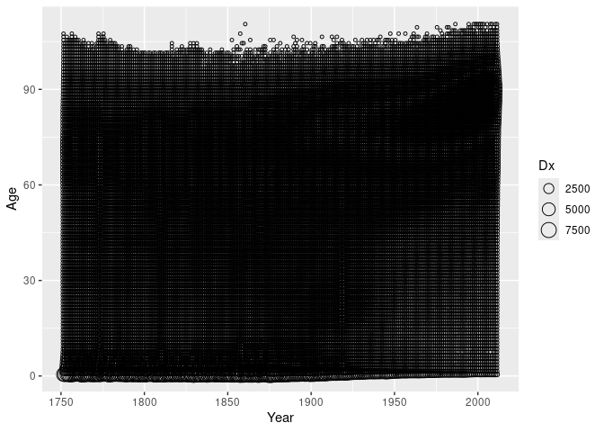<!-- -->

Still not good. Maybe reducing the number of circles would work. In
order to do so we need to aggregate the data into wider period and age
groups. For simple aggregations we can use the *summary2d* feature in
ggplot. It cuts up the area of the plot into larger bins and performs a
summary operation on the data in each bin. We will sum up the death
counts in each 5x5 year square.

``` r
swe %>%
  filter(Sex == "Female") %>%
  mutate(Year = Year + 0.5, Age = Age + 0.5) %>%
  ggplot(aes(x = Year, y = Age)) +
  geom_point(aes(z = Dx, size = after_stat(value)), shape = 1,
             stat = "summary2d",
             binwidth = c(5, 5),
             fun = sum)
```

<!-- -->

Change the size scale to area.

``` r
swe %>%
  filter(Sex == "Female") %>%
  mutate(Year = Year + 0.5, Age = Age + 0.5) %>%
  ggplot(aes(x = Year, y = Age)) +
  geom_point(aes(z = Dx, size = after_stat(value)), shape = 1,
             stat = "summary2d",
             binwidth = c(5, 5),
             fun = sum) +
  scale_size_area()
```

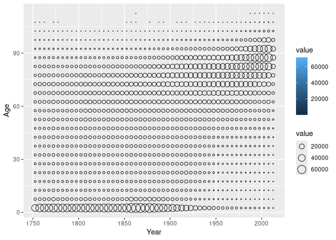<!-- -->

Colour the points.

``` r
swe %>%
  filter(Sex == "Female") %>%
  mutate(Year = Year + 0.5, Age = Age + 0.5) %>%
  ggplot(aes(x = Year, y = Age)) +
  geom_point(aes(z = Dx, size = after_stat(value), colour = after_stat(value)),
             stat = "summary2d",
             binwidth = c(5, 5),
             fun = sum) +
  scale_size_area() +
  theme_classic()
```

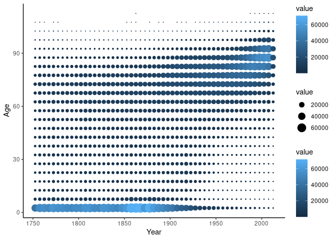<!-- -->

## Further Reading

- [Brilliant color advice from
  NASA](earthobservatory.nasa.gov/blogs/elegantfigures/2013/08/05/subtleties-of-color-part-1-of-6)
- [Generator for categorical color
  scales](http://vrl.cs.brown.edu/color)
- [A perceptually uniform continuous color
  scale](https://www.mrao.cam.ac.uk/~dag/CUBEHELIX/cubetry.html)
- [Color scales for data-viz](colorbrewer2.org)
- Brewer, Cynthia A. 1994. “Guidelines for Use of the Perceptual
  Dimensions of Color for Mapping and Visualization.” In SPIE, edited by
  Jan Bares, 2171:54–63. <doi:10.1117/12.175328>.

``` r
sessionInfo()
```

    ## R version 4.5.1 (2025-06-13)
    ## Platform: x86_64-pc-linux-gnu
    ## Running under: Linux Mint 21.3
    ## 
    ## Matrix products: default
    ## BLAS:   /usr/lib/x86_64-linux-gnu/openblas-pthread/libblas.so.3 
    ## LAPACK: /usr/lib/x86_64-linux-gnu/openblas-pthread/libopenblasp-r0.3.20.so;  LAPACK version 3.10.0
    ## 
    ## locale:
    ##  [1] LC_CTYPE=en_US.UTF-8       LC_NUMERIC=C              
    ##  [3] LC_TIME=en_US.UTF-8        LC_COLLATE=en_US.UTF-8    
    ##  [5] LC_MONETARY=de_DE.UTF-8    LC_MESSAGES=en_US.UTF-8   
    ##  [7] LC_PAPER=de_DE.UTF-8       LC_NAME=C                 
    ##  [9] LC_ADDRESS=C               LC_TELEPHONE=C            
    ## [11] LC_MEASUREMENT=de_DE.UTF-8 LC_IDENTIFICATION=C       
    ## 
    ## time zone: Europe/Berlin
    ## tzcode source: system (glibc)
    ## 
    ## attached base packages:
    ## [1] stats     graphics  grDevices utils     datasets  methods   base     
    ## 
    ## other attached packages:
    ##  [1] lubridate_1.9.4 forcats_1.0.0   stringr_1.5.1   dplyr_1.1.4    
    ##  [5] purrr_1.0.4     readr_2.1.5     tidyr_1.3.1     tibble_3.2.1   
    ##  [9] ggplot2_3.5.1   tidyverse_2.0.0
    ## 
    ## loaded via a namespace (and not attached):
    ##  [1] bit_4.6.0          gtable_0.3.6       crayon_1.5.3       compiler_4.5.1    
    ##  [5] tidyselect_1.2.1   parallel_4.5.1     scales_1.3.0       yaml_2.3.10       
    ##  [9] fastmap_1.2.0      R6_2.6.1           labeling_0.4.3     generics_0.1.3    
    ## [13] curl_6.2.2         knitr_1.50         munsell_0.5.1      RColorBrewer_1.1-3
    ## [17] pillar_1.10.2      tzdb_0.5.0         rlang_1.1.6        utf8_1.2.4        
    ## [21] stringi_1.8.7      xfun_0.52          bit64_4.6.0-1      viridisLite_0.4.2 
    ## [25] timechange_0.3.0   cli_3.6.4          withr_3.0.2        magrittr_2.0.3    
    ## [29] digest_0.6.37      grid_4.5.1         vroom_1.6.5        rstudioapi_0.17.1 
    ## [33] hms_1.1.3          lifecycle_1.0.4    vctrs_0.6.5        evaluate_1.0.3    
    ## [37] glue_1.8.0         farver_2.1.2       colorspace_2.1-1   rmarkdown_2.29    
    ## [41] tools_4.5.1        pkgconfig_2.0.3    htmltools_0.5.8.1

cc-by Jonas Schöley 2025
