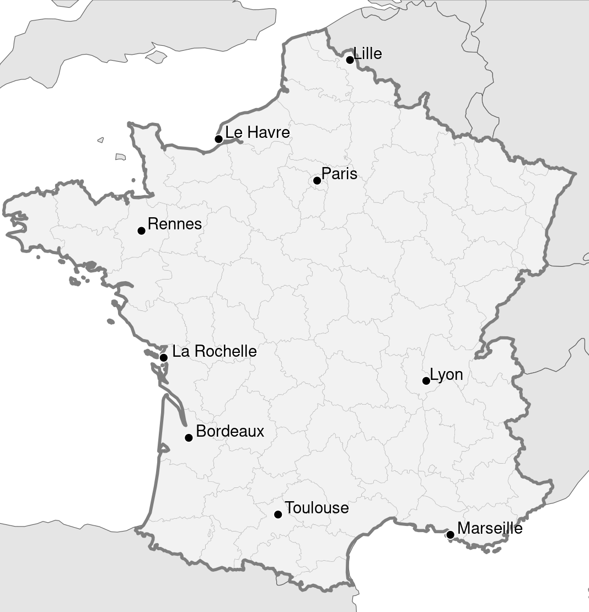

# Basemap

Create a basemap of a region of interest like the one shown below for France. The map should feature

	- a highlighted region of interest
	- an annotation layer indicating points of interest
	- the surrounding geography of your region of interest

Ideally, the region of interest relates to your proposed visualization project, but it is not a strict requirement. The region also does not need to be a nation. It can be a district of a city or something else.

Below you find an example of how this task can be done. You can adapt the code in the [French TFR example](https://github.com/jschoeley/phds25-datavizdesign/tree/main/examples/frenchtfr) to your needs.

If you want to go all the way and plot actual data on the map you could have a look at the `eurostat` library which allows you to download geospatial data for european regions in a format suitable for use with the `sf` library.

