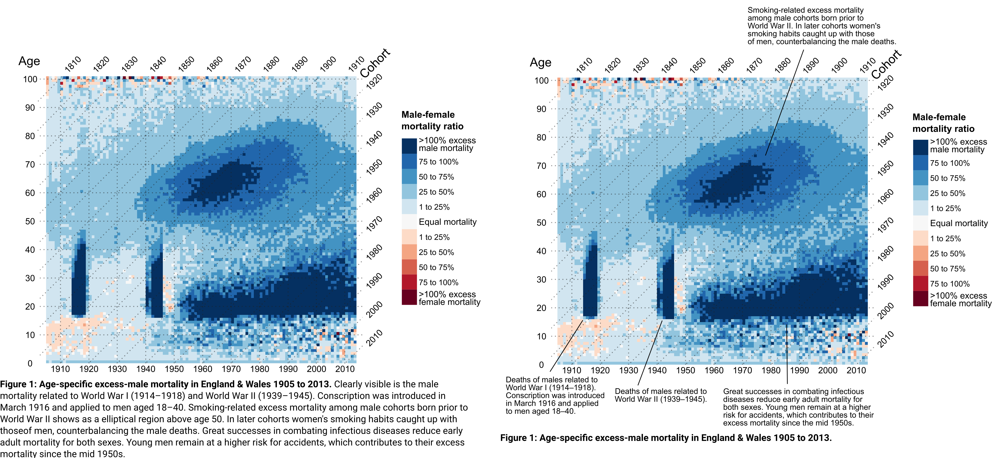

# Direct annotation

Convert the caption of an existing plot into a series of direct annotations.

Below you find an example of how this task can be done.

One way to edit your figure is to export it as svg or pdf and to open it in [Inkscape](https://inkscape.org/).

